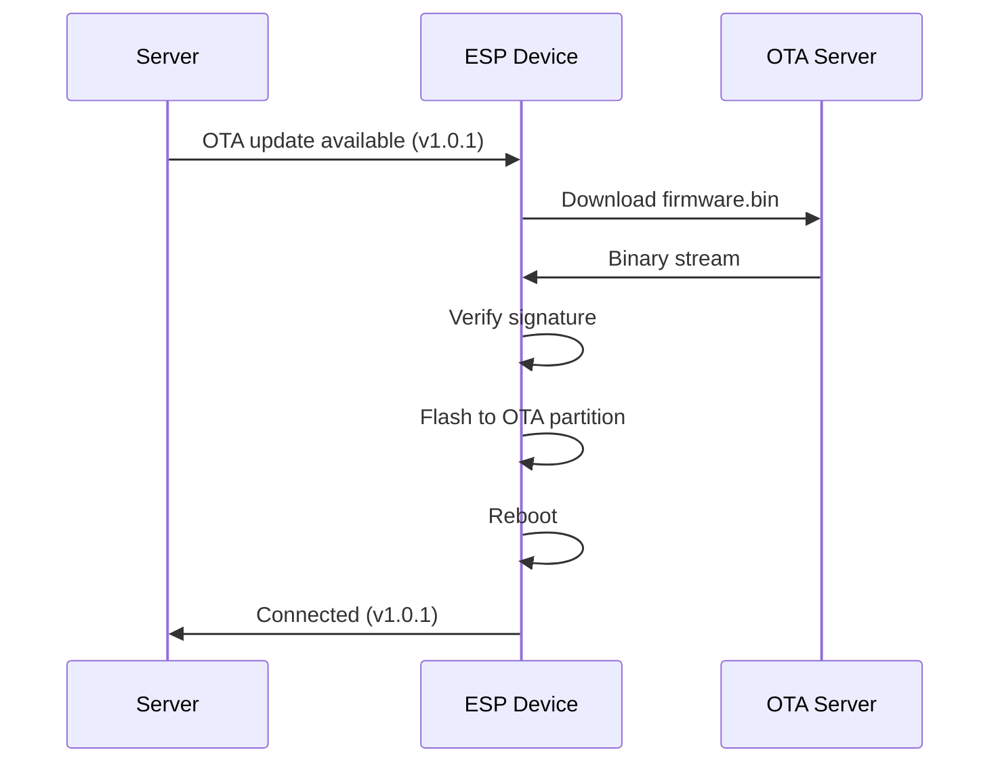

[🇬🇧 English](ota.md) | [🇷🇺 Русский](ota_RU.md)

# OTA Updates

Update WakeLink firmware remotely without physical access.

## Overview

OTA (Over-the-Air) updates allow you to:

- ✅ Update firmware remotely
- ✅ Fix bugs without USB access
- ✅ Roll out new features
- ✅ Maintain devices at scale

## How OTA Works



## Triggering Updates

### From CLI

```bash
# Check for updates
wakelink ota check office-pc

# Install available update
wakelink ota update office-pc

# Force specific version
wakelink ota update office-pc --version 1.0.1
```

### From Server API

```bash
curl -X POST https://wakelink-project.org/api/v1/devices/office-pc/ota \
  -H "Authorization: Bearer $TOKEN" \
  -H "Content-Type: application/json" \
  -d '{"version": "1.0.1"}'
```

### Auto-Update

Enable automatic updates in device config:

```json
{
  "ota": {
    "enabled": true,
    "auto_update": true,
    "update_channel": "stable",
    "update_time": "03:00"
  }
}
```

| Channel | Description |
|---------|-------------|
| `stable` | Tested releases (recommended) |
| `beta` | Pre-release versions |
| `dev` | Latest development builds |

---

## Security

### Firmware Signing

All official firmware is cryptographically signed:

1. **Build** generates unsigned binary
2. **Sign** with private key (ED25519)
3. **Distribute** signed binary to CDN
4. **Device verifies** signature before flashing

```
┌──────────────────┐
│  firmware.bin    │
│  (unsigned)      │
└────────┬─────────┘
         │
         ▼ Sign with private key
┌──────────────────┐
│  firmware.bin    │
│  + signature     │
│  (256 bytes)     │
└────────┬─────────┘
         │
         ▼ Device verifies
┌──────────────────┐
│  Public key      │
│  (embedded)      │
└──────────────────┘
```

### Verification Process

1. Download new firmware to temporary storage
2. Verify ED25519 signature
3. Compare version (must be newer)
4. Flash to inactive OTA partition
5. Set boot flag
6. Reboot

If verification fails, update is rejected.

### Rollback

If new firmware fails to boot:

1. Watchdog triggers reboot
2. Bootloader detects failed boot
3. Reverts to previous partition
4. Device comes back online with old firmware

---

## Manual OTA

### Via Web Interface

1. Access device's local web interface
2. Go to **Update** tab
3. Upload `.bin` file
4. Click **Update**

### Via HTTP POST

```bash
curl -X POST http://192.168.1.100/update \
  -H "Authorization: Bearer local-token" \
  -F "firmware=@wakelink-1.0.1.bin"
```

### Via Arduino OTA (LAN)

For development:

```bash
# PlatformIO
pio run -e esp8266 -t upload --upload-port 192.168.1.100

# Arduino IDE
# Sketch → Export Compiled Binary
# Sketch → Web OTA Update
```

---

## Partition Layout

### ESP8266 (4MB Flash)

```
┌────────────────────────┐ 0x000000
│  Bootloader (4KB)      │
├────────────────────────┤ 0x001000
│  OTA Partition 1       │
│  (1MB)                 │
├────────────────────────┤ 0x101000
│  OTA Partition 2       │
│  (1MB)                 │
├────────────────────────┤ 0x201000
│  SPIFFS                │
│  (Configuration)       │
├────────────────────────┤ 0x3FB000
│  EEPROM Emulation      │
├────────────────────────┤ 0x3FC000
│  RF Calibration        │
└────────────────────────┘ 0x400000
```

### ESP32 (4MB Flash)

```
┌────────────────────────┐ 0x000000
│  Bootloader + NVS      │
├────────────────────────┤ 0x010000
│  OTA Partition 0       │
│  (1.3MB)               │
├────────────────────────┤ 0x150000
│  OTA Partition 1       │
│  (1.3MB)               │
├────────────────────────┤ 0x290000
│  SPIFFS                │
│  (1.5MB)               │
└────────────────────────┘ 0x400000
```

---

## Update Status

### Serial Output

```
[OTA] Checking for updates...
[OTA] Current version: 1.0.0
[OTA] Available: 1.0.1
[OTA] Downloading firmware (524288 bytes)...
[OTA] Progress: 25%
[OTA] Progress: 50%
[OTA] Progress: 75%
[OTA] Progress: 100%
[OTA] Verifying signature...
[OTA] Signature valid
[OTA] Flashing to partition ota_1...
[OTA] Update complete, rebooting...
```

### Error Codes

| Code | Meaning | Solution |
|------|---------|----------|
| `OTA_ERR_CONNECT` | Cannot reach OTA server | Check internet |
| `OTA_ERR_DOWNLOAD` | Download failed | Retry |
| `OTA_ERR_SIGNATURE` | Invalid signature | Use official binary |
| `OTA_ERR_FLASH` | Flash write failed | Factory reset |
| `OTA_ERR_SPACE` | Insufficient space | Use smaller firmware |
| `OTA_ERR_ROLLBACK` | Automatic rollback | Check new version logs |

---

## Self-Hosted OTA Server

For private deployments:

### Directory Structure

```
/var/www/ota/
├── manifest.json
├── esp8266/
│   ├── wakelink-1.0.1.bin
│   └── wakelink-1.0.1.bin.sig
└── esp32/
    ├── wakelink-1.0.1.bin
    └── wakelink-1.0.1.bin.sig
```

### Manifest Format

```json
{
  "stable": {
    "version": "1.0.1",
    "esp8266": {
      "url": "https://ota.example.com/esp8266/wakelink-1.0.1.bin",
      "size": 524288,
      "sha256": "abc123...",
      "signature": "https://ota.example.com/esp8266/wakelink-1.0.1.bin.sig"
    },
    "esp32": {
      "url": "https://ota.example.com/esp32/wakelink-1.0.1.bin",
      "size": 786432,
      "sha256": "def456...",
      "signature": "https://ota.example.com/esp32/wakelink-1.0.1.bin.sig"
    }
  },
  "beta": {...}
}
```

### Device Configuration

```json
{
  "ota": {
    "enabled": true,
    "manifest_url": "https://ota.example.com/manifest.json"
  }
}
```

---

## Best Practices

1. **Test before deploying**: Always test on one device first
2. **Staged rollout**: Update 10% → 50% → 100%
3. **Monitor after update**: Watch for connection issues
4. **Keep rollback option**: Don't disable rollback
5. **Sign all firmware**: Never deploy unsigned builds

---

Continue to [Troubleshooting →](troubleshooting.md)
