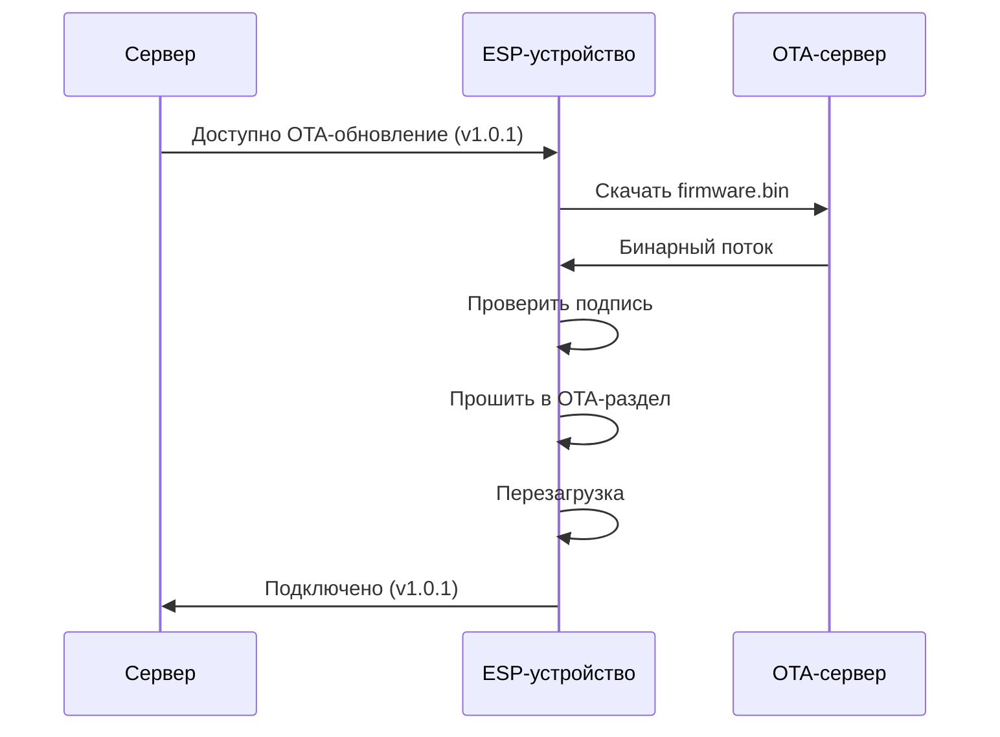

[🇬🇧 English](ota.md) | [🇷🇺 Русский](ota_RU.md)

# OTA-обновления

Удалённое обновление прошивки WakeLink без физического доступа к устройству.

## Обзор

OTA (Over-the-Air) обновления позволяют:

- ✅ Обновлять прошивку удалённо
- ✅ Исправлять ошибки без доступа по USB
- ✅ Разворачивать новые функции
- ✅ Обслуживать устройства в большом масштабе

## Как работают OTA-обновления



## Запуск обновлений

### Через CLI

```bash
# Проверить наличие обновлений
wakelink ota check office-pc

# Установить доступное обновление
wakelink ota update office-pc

# Принудительно установить конкретную версию
wakelink ota update office-pc --version 1.0.1
```

### Через API сервера

```bash
curl -X POST https://wakelink-project.org/api/v1/devices/office-pc/ota \
  -H "Authorization: Bearer $TOKEN" \
  -H "Content-Type: application/json" \
  -d '{"version": "1.0.1"}'
```

### Автоматическое обновление

Включите автоматические обновления в конфигурации устройства:

```json
{
  "ota": {
    "enabled": true,
    "auto_update": true,
    "update_channel": "stable",
    "update_time": "03:00"
  }
}
```

| Канал | Описание |
|-------|----------|
| `stable` | Протестированные релизы (рекомендуется) |
| `beta` | Предрелизные версии |
| `dev` | Последние сборки для разработки |

---

## Безопасность

### Подпись прошивки

Вся официальная прошивка криптографически подписана:

1. **Сборка** генерирует неподписанный бинарный файл
2. **Подпись** закрытым ключом (ED25519)
3. **Распространение** подписанного бинарного файла через CDN
4. **Устройство проверяет** подпись перед прошивкой

```
┌──────────────────┐
│  firmware.bin    │
│  (unsigned)      │
└────────┬─────────┘
         │
         ▼ Sign with private key
┌──────────────────┐
│  firmware.bin    │
│  + signature     │
│  (256 bytes)     │
└────────┬─────────┘
         │
         ▼ Device verifies
┌──────────────────┐
│  Public key      │
│  (embedded)      │
└──────────────────┘
```

### Процесс проверки

1. Скачать новую прошивку во временное хранилище
2. Проверить подпись ED25519
3. Сравнить версию (должна быть новее)
4. Прошить неактивный OTA-раздел
5. Установить флаг загрузки
6. Перезагрузить устройство

Если проверка не пройдена, обновление отклоняется.

### Откат

Если новая прошивка не загружается:

1. Сторожевой таймер запускает перезагрузку
2. Загрузчик обнаруживает неудачную загрузку
3. Возврат к предыдущему разделу
4. Устройство выходит в сеть со старой прошивкой

---

## Ручное OTA-обновление

### Через веб-интерфейс

1. Зайдите на локальный веб-интерфейс устройства
2. Перейдите на вкладку **Update**
3. Загрузите файл `.bin`
4. Нажмите **Update**

### Через HTTP POST

```bash
curl -X POST http://192.168.1.100/update \
  -H "Authorization: Bearer local-token" \
  -F "firmware=@wakelink-1.0.1.bin"
```

### Через Arduino OTA (LAN)

Для разработки:

```bash
# PlatformIO
pio run -e esp8266 -t upload --upload-port 192.168.1.100

# Arduino IDE
# Sketch → Export Compiled Binary
# Sketch → Web OTA Update
```

---

## Разметка разделов

### ESP8266 (Flash 4 МБ)

```
┌────────────────────────┐ 0x000000
│  Bootloader (4KB)      │
├────────────────────────┤ 0x001000
│  OTA Partition 1       │
│  (1MB)                 │
├────────────────────────┤ 0x101000
│  OTA Partition 2       │
│  (1MB)                 │
├────────────────────────┤ 0x201000
│  SPIFFS                │
│  (Configuration)       │
├────────────────────────┤ 0x3FB000
│  EEPROM Emulation      │
├────────────────────────┤ 0x3FC000
│  RF Calibration        │
└────────────────────────┘ 0x400000
```

### ESP32 (Flash 4 МБ)

```
┌────────────────────────┐ 0x000000
│  Bootloader + NVS      │
├────────────────────────┤ 0x010000
│  OTA Partition 0       │
│  (1.3MB)               │
├────────────────────────┤ 0x150000
│  OTA Partition 1       │
│  (1.3MB)               │
├────────────────────────┤ 0x290000
│  SPIFFS                │
│  (1.5MB)               │
└────────────────────────┘ 0x400000
```

---

## Статус обновления

### Вывод в serial

```
[OTA] Checking for updates...
[OTA] Current version: 1.0.0
[OTA] Available: 1.0.1
[OTA] Downloading firmware (524288 bytes)...
[OTA] Progress: 25%
[OTA] Progress: 50%
[OTA] Progress: 75%
[OTA] Progress: 100%
[OTA] Verifying signature...
[OTA] Signature valid
[OTA] Flashing to partition ota_1...
[OTA] Update complete, rebooting...
```

### Коды ошибок

| Код | Значение | Решение |
|-----|----------|---------|
| `OTA_ERR_CONNECT` | Нет доступа к OTA-серверу | Проверьте интернет |
| `OTA_ERR_DOWNLOAD` | Ошибка загрузки | Повторите попытку |
| `OTA_ERR_SIGNATURE` | Недействительная подпись | Используйте официальный бинарный файл |
| `OTA_ERR_FLASH` | Ошибка записи Flash | Выполните сброс к заводским настройкам |
| `OTA_ERR_SPACE` | Недостаточно места | Используйте прошивку меньшего размера |
| `OTA_ERR_ROLLBACK` | Автоматический откат | Проверьте логи новой версии |

---

## Собственный OTA-сервер

Для частных развёртываний:

### Структура директорий

```
/var/www/ota/
├── manifest.json
├── esp8266/
│   ├── wakelink-1.0.1.bin
│   └── wakelink-1.0.1.bin.sig
└── esp32/
    ├── wakelink-1.0.1.bin
    └── wakelink-1.0.1.bin.sig
```

### Формат манифеста

```json
{
  "stable": {
    "version": "1.0.1",
    "esp8266": {
      "url": "https://ota.example.com/esp8266/wakelink-1.0.1.bin",
      "size": 524288,
      "sha256": "abc123...",
      "signature": "https://ota.example.com/esp8266/wakelink-1.0.1.bin.sig"
    },
    "esp32": {
      "url": "https://ota.example.com/esp32/wakelink-1.0.1.bin",
      "size": 786432,
      "sha256": "def456...",
      "signature": "https://ota.example.com/esp32/wakelink-1.0.1.bin.sig"
    }
  },
  "beta": {...}
}
```

### Конфигурация устройства

```json
{
  "ota": {
    "enabled": true,
    "manifest_url": "https://ota.example.com/manifest.json"
  }
}
```

---

## Рекомендации

1. **Тестируйте перед развёртыванием**: всегда проверяйте на одном устройстве
2. **Поэтапный выкат**: 10% → 50% → 100%
3. **Мониторинг после обновления**: следите за проблемами с подключением
4. **Сохраняйте возможность отката**: не отключайте откат
5. **Подписывайте всю прошивку**: никогда не развёртывайте неподписанные сборки

---

Далее: [Устранение неполадок →](troubleshooting_RU.md)
