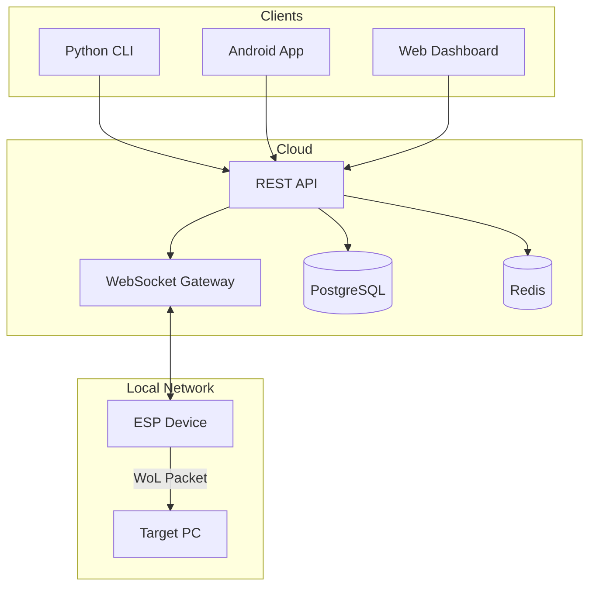
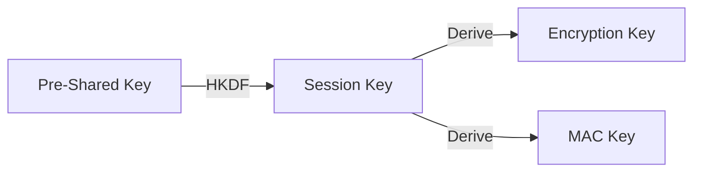

[🇬🇧 English](architecture.md) | [🇷🇺 Русский](architecture_RU.md)

# Architecture

Understanding how WakeLink components work together.

## System Overview



## Components

### 1. ESP Device (Firmware)

The heart of WakeLink — a small microcontroller that:

- Maintains persistent WebSocket connection to server
- Receives encrypted commands
- Decrypts and verifies command authenticity
- Sends Wake-on-LAN magic packets
- Reports acknowledgments back

**Key Characteristics:**
- Low power consumption (~70mA active, ~20μA deep sleep)
- Automatic reconnection on network failures
- OTA (Over-the-Air) update support
- Local fallback mode (REST API on local network)

### 2. Server (Relay)

The relay server acts as a bridge between clients and ESP devices:

```mermaid
sequenceDiagram
    participant C as Client
    participant A as API Server
    participant W as WebSocket Gateway
    participant E as ESP Device

    C->>A: POST /devices/{id}/wake
    A->>A: Validate token
    A->>W: Forward command
    W->>E: Send via WebSocket
    E->>E: Decrypt & execute
    E->>W: ACK response
    W->>A: Response received
    A->>C: 200 OK {status: success}
```



**Components:**
- **REST API**: FastAPI-based, handles authentication and device management
- **WebSocket Gateway**: Maintains persistent connections to ESP devices
- **PostgreSQL**: Stores users, devices, tokens
- **Redis**: Session cache, rate limiting, pub/sub for real-time

### 3. Clients

Multiple ways to interact with WakeLink:

| Client | Use Case | Features |
|--------|----------|----------|
| **CLI** | Power users, automation | Full API access, scripting |
| **Android** | Mobile users | Push notifications, widgets |
| **Web** | Management | Device registration, logs |
| **API** | Integration | REST endpoints, webhooks |

## Data Flow

### Wake Command Flow

```
1. User triggers wake (CLI/App/API)
         │
         ▼
2. Client encrypts command payload
   - Algorithm: XChaCha20-Poly1305
   - Includes: device_id, timestamp, nonce
         │
         ▼
3. API receives request
   - Validates JWT token
   - Checks device ownership
   - Rate limit check
         │
         ▼
4. WebSocket Gateway forwards
   - Looks up device connection
   - Sends encrypted packet
   - Starts response timeout
         │
         ▼
5. ESP Device processes
   - Decrypts payload
   - Verifies timestamp (anti-replay)
   - Validates chain hash
   - Sends WoL magic packet
   - Builds encrypted ACK
         │
         ▼
6. Response propagates back
   - ESP → WS Gateway → API → Client
```

### Packet Structure (EWSP v1.0)

```json
{
  "v": 2,
  "id": "550e8400-e29b-41d4-a716-446655440000",
  "seq": 42,
  "prev": "a1b2c3d4...",
  "p": "<encrypted-payload-base64>",
  "sig": "hmac-sha256-signature"
}
```

| Field | Description |
|-------|-------------|
| `v` | Protocol version |
| `id` | Request ID (UUID) |
| `seq` | Sequence number (monotonic) |
| `prev` | Previous packet hash (chain) |
| `p` | Encrypted payload |
| `sig` | HMAC-SHA256 signature |

## Security Model

### Encryption Layers

```
┌─────────────────────────────────────────┐
│           TLS 1.3 (Transport)           │
├─────────────────────────────────────────┤
│  XChaCha20-Poly1305 (Application)       │
├─────────────────────────────────────────┤
│      HMAC-SHA256 (Integrity)            │
└─────────────────────────────────────────┘
```

1. **Transport**: TLS 1.3 encrypts all network traffic
2. **Application**: XChaCha20-Poly1305 encrypts command payloads
3. **Integrity**: HMAC-SHA256 ensures packets aren't tampered

### Key Management



- **Pre-Shared Key (PSK)**: Generated during device registration
- **Session Key**: Derived via HKDF at session start
- **Encryption/MAC Keys**: Derived from session key

### Replay Protection

Two mechanisms prevent replay attacks:

1. **Sequence Numbers**: Monotonically increasing, never repeated
2. **Chain Hashing**: Each packet includes hash of previous packet

```
Packet 1: hash=SHA256(payload1), prev=0
Packet 2: hash=SHA256(payload2), prev=hash1
Packet 3: hash=SHA256(payload3), prev=hash2
```

If an attacker replays Packet 2, the chain breaks.

## Network Topology

### Typical Deployment

```
┌─────────────────────────────────────────────────────────┐
│                        Internet                         │
└─────────────────────────────────────────────────────────┘
          │                              │
          │ HTTPS                        │ WSS
          ▼                              ▼
┌──────────────────┐          ┌──────────────────┐
│  Mobile Phone    │          │  WakeLink Server │
│  (Android App)   │          │  (Cloud/Docker)  │
└──────────────────┘          └────────┬─────────┘
                                       │
                                       │ WSS (persistent)
                                       ▼
                              ┌──────────────────┐
                              │    Home Router   │
                              │   (NAT/Firewall) │
                              └────────┬─────────┘
                                       │
                    ┌──────────────────┼──────────────────┐
                    │                  │                  │
            ┌───────▼───────┐  ┌───────▼───────┐  ┌───────▼───────┐
            │  ESP Device   │  │   Target PC   │  │  Other Devices│
            │  (WakeLink)   │  │  (WoL Target) │  │               │
            └───────────────┘  └───────────────┘  └───────────────┘
```

### No Port Forwarding Required

WakeLink uses **outbound connections only**:

1. ESP connects to server (outbound WSS)
2. Server can push commands over existing connection
3. No inbound ports needed on home router

## Fault Tolerance

### ESP Device

| Failure | Recovery |
|---------|----------|
| WiFi disconnect | Auto-reconnect with exponential backoff |
| Server unavailable | Queue commands, retry on reconnect |
| Power loss | Full state restored from flash on boot |

### Server

| Failure | Recovery |
|---------|----------|
| API crash | Container auto-restart, stateless design |
| WebSocket disconnect | ESP reconnects, session restored from Redis |
| Database unavailable | Graceful degradation, queued writes |

## Scalability

### Horizontal Scaling

```
                    ┌─────────────┐
                    │   Nginx     │
                    │ Load Balancer│
                    └──────┬──────┘
                           │
         ┌─────────────────┼─────────────────┐
         │                 │                 │
   ┌─────▼─────┐     ┌─────▼─────┐     ┌─────▼─────┐
   │  API Pod  │     │  API Pod  │     │  API Pod  │
   └─────┬─────┘     └─────┬─────┘     └─────┬─────┘
         │                 │                 │
         └────────────┬────┴─────────────────┘
                      │
              ┌───────▼───────┐
              │     Redis     │
              │  (Pub/Sub)    │
              └───────────────┘
```

- API pods are stateless, scale horizontally
- WebSocket connections sticky to pod via Redis pub/sub
- Database can be replicated for read scaling

### Performance Targets

| Metric | Target |
|--------|--------|
| Wake latency (P95) | < 500ms |
| Concurrent devices | 10,000+ per server |
| API requests | 1,000 req/s |
| WebSocket connections | 50,000 per node |

---

## Further Reading

- [EWSP Protocol Specification](../security/ewsp.md)
- [Server Deployment](../server/docker.md)
- [Firmware Deep Dive](../firmware/index.md)
