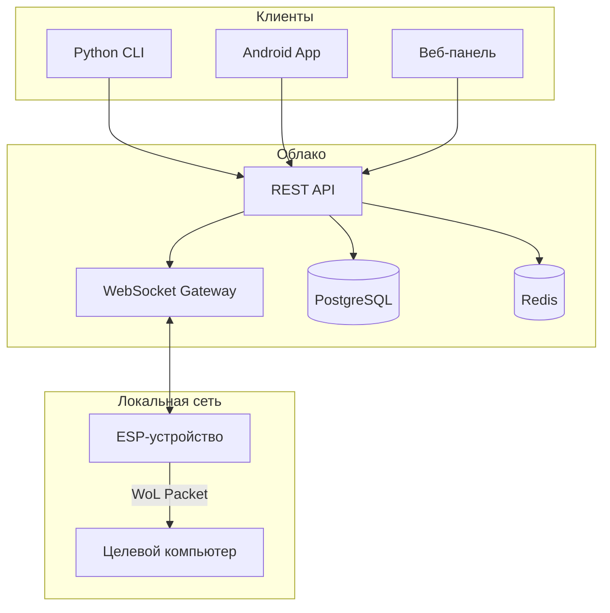
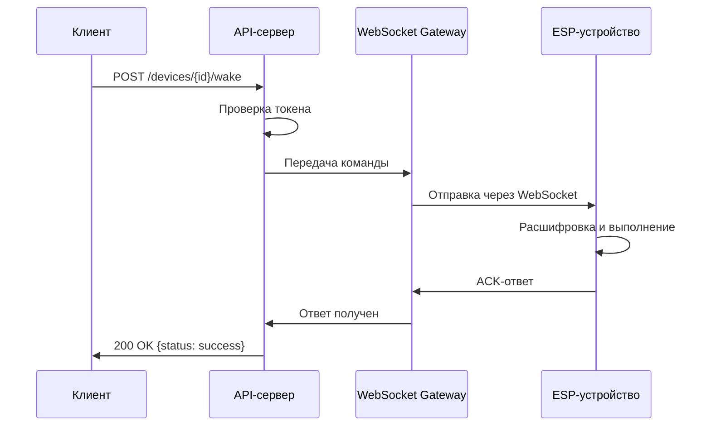
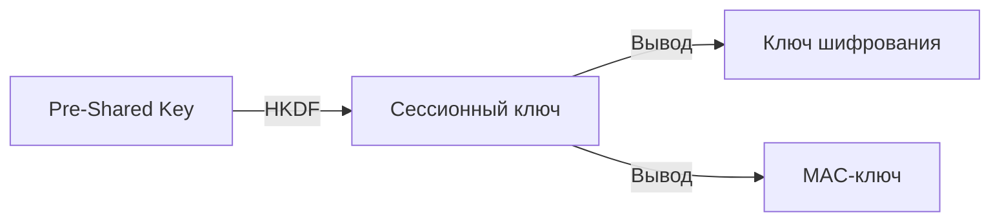

[🇬🇧 English](architecture.md) | [🇷🇺 Русский](architecture_RU.md)

# Архитектура

Понимание того, как компоненты WakeLink работают вместе.

## Общая схема системы



## Компоненты

### 1. ESP-устройство (прошивка)

Сердце WakeLink — небольшой микроконтроллер, который:

- Поддерживает постоянное WebSocket-соединение с сервером
- Получает зашифрованные команды
- Расшифровывает и проверяет подлинность команд
- Отправляет Wake-on-LAN магические пакеты
- Возвращает подтверждения выполнения

**Ключевые характеристики:**
- Низкое энергопотребление (~70 мА в активном режиме, ~20 мкА в глубоком сне)
- Автоматическое переподключение при сбоях сети
- Поддержка OTA (обновление по воздуху)
- Локальный резервный режим (REST API в локальной сети)

### 2. Сервер (Relay)

Relay-сервер выступает мостом между клиентами и ESP-устройствами:



**Компоненты:**
- **REST API**: На основе FastAPI, управляет аутентификацией и устройствами
- **WebSocket Gateway**: Поддерживает постоянные соединения с ESP-устройствами
- **PostgreSQL**: Хранит пользователей, устройства, токены
- **Redis**: Кэш сессий, ограничение запросов, pub/sub для реального времени

### 3. Клиенты

Несколько способов взаимодействия с WakeLink:

| Клиент | Сценарий использования | Возможности |
|--------|----------------------|------------|
| **CLI** | Опытные пользователи, автоматизация | Полный доступ к API, скриптинг |
| **Android** | Мобильные пользователи | Push-уведомления, виджеты |
| **Web** | Управление | Регистрация устройств, логи |
| **API** | Интеграция | REST-эндпоинты, вебхуки |

## Поток данных

### Поток команды пробуждения

```
1. Пользователь инициирует пробуждение (CLI/App/API)
         │
         ▼
2. Клиент шифрует полезную нагрузку команды
   - Алгоритм: XChaCha20-Poly1305
   - Содержит: device_id, timestamp, nonce
         │
         ▼
3. API получает запрос
   - Проверяет JWT-токен
   - Проверяет владение устройством
   - Проверка ограничения запросов
         │
         ▼
4. WebSocket Gateway пересылает
   - Находит соединение с устройством
   - Отправляет зашифрованный пакет
   - Запускает таймаут ожидания ответа
         │
         ▼
5. ESP-устройство обрабатывает
   - Расшифровывает нагрузку
   - Проверяет временную метку (защита от повторных атак)
   - Проверяет хэш цепочки
   - Отправляет WoL магический пакет
   - Формирует зашифрованный ACK
         │
         ▼
6. Ответ распространяется обратно
   - ESP → WS Gateway → API → Клиент
```

### Структура пакета (EWSP v1.0)

```json
{
  "v": 2,
  "id": "550e8400-e29b-41d4-a716-446655440000",
  "seq": 42,
  "prev": "a1b2c3d4...",
  "p": "<encrypted-payload-base64>",
  "sig": "hmac-sha256-signature"
}
```

| Поле | Описание |
|------|---------|
| `v` | Версия протокола |
| `id` | Идентификатор запроса (UUID) |
| `seq` | Порядковый номер (монотонно возрастающий) |
| `prev` | Хэш предыдущего пакета (цепочка) |
| `p` | Зашифрованная нагрузка |
| `sig` | Подпись HMAC-SHA256 |

## Модель безопасности

### Уровни шифрования

```
┌─────────────────────────────────────────┐
│           TLS 1.3 (Транспорт)           │
├─────────────────────────────────────────┤
│  XChaCha20-Poly1305 (Приложение)        │
├─────────────────────────────────────────┤
│      HMAC-SHA256 (Целостность)          │
└─────────────────────────────────────────┘
```

1. **Транспорт**: TLS 1.3 шифрует весь сетевой трафик
2. **Приложение**: XChaCha20-Poly1305 шифрует полезные нагрузки команд
3. **Целостность**: HMAC-SHA256 гарантирует отсутствие подмены пакетов

### Управление ключами



- **Pre-Shared Key (PSK)**: Генерируется при регистрации устройства
- **Сессионный ключ**: Выводится через HKDF в начале сессии
- **Ключи шифрования/MAC**: Выводятся из сессионного ключа

### Защита от повторных атак

Два механизма предотвращают повторные атаки:

1. **Порядковые номера**: Монотонно возрастающие, никогда не повторяются
2. **Цепочечное хэширование**: Каждый пакет содержит хэш предыдущего

```
Пакет 1: hash=SHA256(payload1), prev=0
Пакет 2: hash=SHA256(payload2), prev=hash1
Пакет 3: hash=SHA256(payload3), prev=hash2
```

При повторной отправке пакета 2 злоумышленником цепочка разрывается.

## Сетевая топология

### Типовое развёртывание

```
┌─────────────────────────────────────────────────────────┐
│                        Интернет                         │
└─────────────────────────────────────────────────────────┘
          │                              │
          │ HTTPS                        │ WSS
          ▼                              ▼
┌──────────────────┐          ┌──────────────────┐
│  Мобильный       │          │  WakeLink Server │
│  телефон         │          │  (Cloud/Docker)  │
└──────────────────┘          └────────┬─────────┘
                                       │
                                       │ WSS (постоянное)
                                       ▼
                              ┌──────────────────┐
                              │  Домашний роутер │
                              │   (NAT/Firewall) │
                              └────────┬─────────┘
                                       │
                    ┌──────────────────┼──────────────────┐
                    │                  │                  │
            ┌───────▼───────┐  ┌───────▼───────┐  ┌───────▼───────┐
            │  ESP-устройство│  │  Целевой ПК   │  │Другие устройства│
            │  (WakeLink)   │  │  (WoL Target) │  │               │
            └───────────────┘  └───────────────┘  └───────────────┘
```

### Проброс портов не нужен

WakeLink использует **только исходящие соединения**:

1. ESP подключается к серверу (исходящий WSS)
2. Сервер может отправлять команды по существующему соединению
3. Входящие порты на домашнем роутере не нужны

## Отказоустойчивость

### ESP-устройство

| Сбой | Восстановление |
|------|---------------|
| Отключение WiFi | Автопереподключение с экспоненциальной задержкой |
| Недоступность сервера | Очередь команд, повтор при переподключении |
| Потеря питания | Полное восстановление состояния из flash при загрузке |

### Сервер

| Сбой | Восстановление |
|------|---------------|
| Сбой API | Автоперезапуск контейнера, stateless-дизайн |
| Разрыв WebSocket | ESP переподключается, сессия восстанавливается из Redis |
| Недоступность базы данных | Деградация с сохранением части функций, буферизация записей |

## Масштабируемость

### Горизонтальное масштабирование

```
                    ┌─────────────┐
                    │   Nginx     │
                    │Балансировщик│
                    └──────┬──────┘
                           │
         ┌─────────────────┼─────────────────┐
         │                 │                 │
   ┌─────▼─────┐     ┌─────▼─────┐     ┌─────▼─────┐
   │  API Pod  │     │  API Pod  │     │  API Pod  │
   └─────┬─────┘     └─────┬─────┘     └─────┬─────┘
         │                 │                 │
         └────────────┬────┴─────────────────┘
                      │
              ┌───────▼───────┐
              │     Redis     │
              │  (Pub/Sub)    │
              └───────────────┘
```

- API-поды не имеют состояния, масштабируются горизонтально
- WebSocket-соединения закреплены за подом через Redis pub/sub
- База данных может быть реплицирована для масштабирования чтения

### Целевые показатели производительности

| Метрика | Цель |
|---------|------|
| Задержка пробуждения (P95) | < 500 мс |
| Одновременных устройств | 10 000+ на сервер |
| API-запросов | 1 000 запр/с |
| WebSocket-соединений | 50 000 на узел |

---

## Дополнительное чтение

- [Спецификация протокола EWSP](../security/ewsp.md)
- [Развёртывание сервера](../server/docker.md)
- [Детальное описание прошивки](../firmware/index.md)
