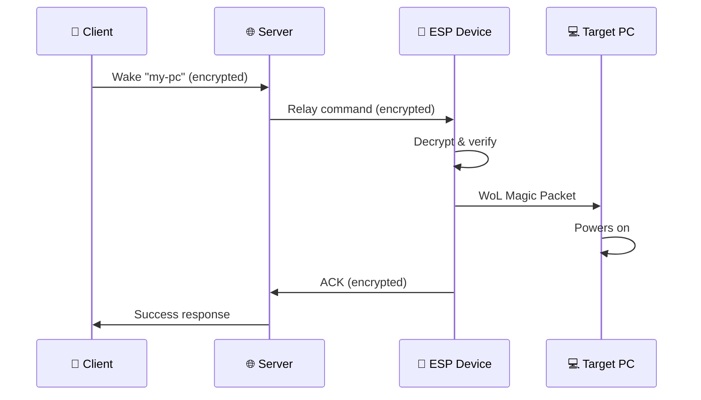

# WakeLink Documentation

**Wake-on-LAN over Internet with End-to-End Encryption**

-   :material-clock-fast:{ .lg .middle } __Quick Start__

    ---

    Get your first device online in 5 minutes

    [:octicons-arrow-right-24: Getting Started](getting-started/quickstart.md)

-   :material-chip:{ .lg .middle } __Firmware__

    ---

    Flash and configure ESP8266/ESP32 devices

    [:octicons-arrow-right-24: Firmware Guide](firmware/index.md)

-   :material-server:{ .lg .middle } __Self-Hosted Server__

    ---

    Deploy your own WakeLink relay server

    [:octicons-arrow-right-24: Server Setup](server/index.md)

-   :material-security:{ .lg .middle } __Security__

    ---

    Learn about EWSP protocol and encryption

    [:octicons-arrow-right-24: Security Overview](security/index.md)

---

## What is WakeLink?

WakeLink is an open-source system for remotely waking up computers over the Internet using Wake-on-LAN (WoL) magic packets. Unlike traditional WoL which only works on local networks, WakeLink provides:

- 🔐 **End-to-end encryption** — Your wake commands are encrypted using XChaCha20-Poly1305
- 🌐 **Works anywhere** — Wake your PC from anywhere in the world
- 🔌 **No port forwarding** — Uses WebSocket relay, no router configuration needed
- 📱 **Multiple clients** — Command line, Android app, and REST API
- 🏠 **Self-hostable** — Run your own server for complete control

## How It Works

1. **You send a wake command** from your phone or CLI
2. **Server relays** the encrypted command to your ESP device
3. **ESP device decrypts** and verifies the command
4. **ESP sends WoL packet** to your target computer
5. **Computer wakes up** and you get confirmation

## Components

| Component | Description | Platform |
|-----------|-------------|----------|
| [Firmware](firmware/index.md) | Runs on ESP8266/ESP32, sends WoL packets | Arduino/PlatformIO |
| [Server](server/index.md) | WebSocket relay and REST API | Docker/Python |
| [CLI](clients/cli.md) | Command-line client | Python |
| [Android](clients/android.md) | Mobile app | Android 8+ |

## Requirements

- **Hardware**: ESP8266 or ESP32 board (~$3-5)
- **Software**: Docker (for server) or use our hosted relay
- **Network**: WiFi connection on the same LAN as target PC
- **Target PC**: Motherboard with Wake-on-LAN support enabled

## Quick Links

- [5-Minute Quick Start](getting-started/quickstart.md)
- [Hardware Requirements](getting-started/requirements.md)
- [Troubleshooting](firmware/troubleshooting.md)
- [FAQ](reference/faq.md)

---

## Getting Help

- 💬 **Discord**: [discord.gg/wakelink](https://discord.gg/wakelink)
- 🐛 **Issues**: [GitHub Issues](https://github.com/wakelinkdev/wakelink/issues)
- 📧 **Email**: support@wakelink.io

## Contributing

WakeLink is open source! Contributions are welcome.

- [Contributing Guide](https://github.com/wakelinkdev/wakelink/blob/main/CONTRIBUTING.md)
- [Code of Conduct](https://github.com/wakelinkdev/wakelink/blob/main/CODE_OF_CONDUCT.md)

---

<small>WakeLink v1.0.0 • Licensed under MIT</small>
