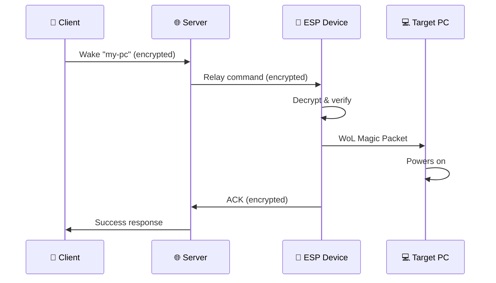

[🇬🇧 English](index.md) | [🇷🇺 Русский](index_RU.md)

# Документация WakeLink

**Wake-on-LAN через Интернет с сквозным шифрованием**

-   :material-clock-fast:{ .lg .middle } __Быстрый старт__

    ---

    Подключите первое устройство за 5 минут

    [:octicons-arrow-right-24: Начало работы](getting-started/quickstart.md)

-   :material-chip:{ .lg .middle } __Прошивка__

    ---

    Прошивка и настройка устройств ESP8266/ESP32

    [:octicons-arrow-right-24: Руководство по прошивке](firmware/index.md)

-   :material-server:{ .lg .middle } __Собственный сервер__

    ---

    Разверните собственный relay-сервер WakeLink

    [:octicons-arrow-right-24: Настройка сервера](server/index.md)

-   :material-security:{ .lg .middle } __Безопасность__

    ---

    Узнайте о протоколе EWSP и шифровании

    [:octicons-arrow-right-24: Обзор безопасности](security/index.md)

---

## Что такое WakeLink?

WakeLink — это система с открытым исходным кодом для удалённого пробуждения компьютеров через Интернет с использованием магических пакетов Wake-on-LAN (WoL). В отличие от традиционного WoL, работающего только в локальных сетях, WakeLink предоставляет:

- 🔐 **Сквозное шифрование** — Команды пробуждения шифруются с помощью XChaCha20-Poly1305
- 🌐 **Работает везде** — Пробудите ПК из любой точки мира
- 🔌 **Без проброса портов** — Использует WebSocket relay, настройка роутера не требуется
- 📱 **Множество клиентов** — Командная строка, Android-приложение и REST API
- 🏠 **Самостоятельный хостинг** — Запустите собственный сервер для полного контроля

## Как это работает

1. **Вы отправляете команду пробуждения** с телефона или CLI
2. **Сервер передаёт** зашифрованную команду на ваше устройство ESP
3. **Устройство ESP расшифровывает** и проверяет команду
4. **ESP отправляет WoL-пакет** на целевой компьютер
5. **Компьютер включается**, и вы получаете подтверждение

## Компоненты

| Компонент | Описание | Платформа |
|-----------|----------|-----------|
| [Прошивка](firmware/index.md) | Работает на ESP8266/ESP32, отправляет WoL-пакеты | Arduino/PlatformIO |
| [Сервер](server/index.md) | WebSocket relay и REST API | Docker/Python |
| [CLI](clients/cli.md) | Клиент командной строки | Python |
| [Android](clients/android.md) | Мобильное приложение | Android 8+ |

## Требования

- **Железо**: Плата ESP8266 или ESP32 (~$3-5)
- **ПО**: Docker (для сервера) или используйте наш хостируемый relay
- **Сеть**: WiFi-соединение в той же локальной сети, что и целевой ПК
- **Целевой ПК**: Материнская плата с поддержкой Wake-on-LAN (включено в BIOS)

## Быстрые ссылки

- [Быстрый старт за 5 минут](getting-started/quickstart.md)
- [Требования к оборудованию](getting-started/requirements.md)
- [Устранение неполадок](firmware/troubleshooting.md)
- [FAQ](reference/faq.md)

---

## Получить помощь

- 💬 **Discord**: [discord.gg/wakelink](https://discord.gg/wakelink)
- 🐛 **Баги**: [GitHub Issues](https://github.com/wakelinkdev/wakelink/issues)
- 📧 **Email**: support@wakelink.io

## Участие в разработке

WakeLink — открытый проект! Мы приветствуем вклад сообщества.

- [Руководство по участию](https://github.com/wakelinkdev/wakelink/blob/main/CONTRIBUTING.md)
- [Кодекс поведения](https://github.com/wakelinkdev/wakelink/blob/main/CODE_OF_CONDUCT.md)

---

<small>WakeLink v1.0.0 • Лицензия MIT</small>
