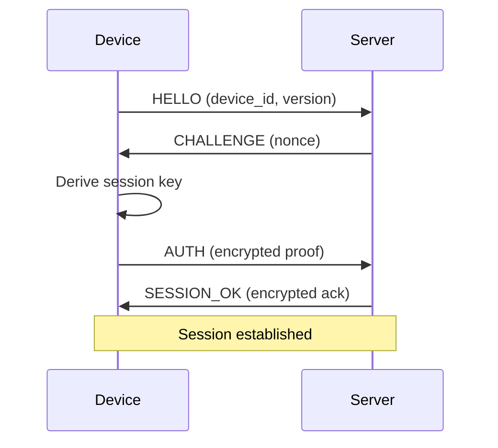

[🇬🇧 English](ewsp.md) | [🇷🇺 Русский](ewsp_RU.md)

# EWSP Protocol

**Encrypted Wake Signaling Protocol** — The secure communication protocol used by WakeLink.

## Overview

EWSP v1.0 is a lightweight, encrypted protocol designed for:

- **Constrained devices** — Minimal memory footprint for ESP8266/ESP32
- **End-to-end encryption** — Server acts as blind relay
- **Replay protection** — Cryptographic packet chaining
- **Efficiency** — JSON-based, human-readable when needed

## Protocol Version

Current version: **1.0**

Changes from v1.x:
- Added blockchain-style packet chaining
- Upgraded to XChaCha20-Poly1305
- Added structured error codes
- Improved key derivation

---

## Packet Structure

### Outer Packet (Wire Format)

```json
{
  "v": 2,
  "id": "550e8400-e29b-41d4-a716-446655440000",
  "seq": 42,
  "prev": "a1b2c3d4e5f6...",
  "p": "<base64-encrypted-payload>",
  "sig": "<hmac-sha256>"
}
```

| Field | Type | Description |
|-------|------|-------------|
| `v` | int | Protocol version (2) |
| `id` | string | Request ID (UUID v4) |
| `seq` | int | Sequence number (monotonic) |
| `prev` | string | Hash of previous packet (hex, 32 bytes) |
| `p` | string | Encrypted payload (base64) |
| `sig` | string | HMAC-SHA256 of entire packet (hex) |

### Inner Packet (Decrypted Payload)

```json
{
  "cmd": "WAKE",
  "rid": "req-123",
  "ts": 1705312200,
  "data": {
    "target": "AA:BB:CC:DD:EE:FF"
  }
}
```

| Field | Type | Description |
|-------|------|-------------|
| `cmd` | string | Command name |
| `rid` | string | Request ID for correlation |
| `ts` | int | Unix timestamp |
| `data` | object | Command-specific data |

---

## Commands

### Client → Device

| Command | Description | Data |
|---------|-------------|------|
| `PING` | Connectivity check | None |
| `WAKE` | Send WoL packet | `target`: MAC address |
| `INFO` | Request device info | None |
| `CONFIG` | Update configuration | Config object |
| `OTA` | Trigger firmware update | `url`, `version` |
| `RESTART` | Restart device | None |

### Device → Server

| Command | Description | Data |
|---------|-------------|------|
| `ACK` | Command acknowledgment | `rid`, `status` |
| `STATUS` | Status report | Device status object |
| `ERROR` | Error report | Error code, message |

---

## Encryption Flow

### Session Establishment



### Key Derivation

```
PSK = Pre-Shared Key (32 bytes, from device registration)

Session Salt = SHA256(device_id || timestamp || nonce)

Session Key = HKDF-SHA256(
    ikm = PSK,
    salt = Session Salt,
    info = "ewsp-v1-session",
    length = 64
)

Encryption Key = Session Key[0:32]
MAC Key = Session Key[32:64]
```

### Packet Encryption

1. Generate 24-byte random nonce
2. Encrypt payload with XChaCha20-Poly1305
3. Prepend nonce to ciphertext
4. Base64 encode result

```
Payload JSON → UTF-8 bytes → XChaCha20-Poly1305 → Base64
```

### Packet Signing

```
signature = HMAC-SHA256(MAC_Key, canonical_packet)

canonical_packet = JSON.stringify({
    v: v,
    id: id,
    seq: seq,
    prev: prev,
    p: p
}, sorted_keys)
```

---

## Chain Validation

Each packet must reference the previous packet:

```
Packet N:
  - Compute hash: h_n = SHA256(packet_n_bytes)
  - Verify: packet_{n+1}.prev == h_n
```

### Chain State

Both sides maintain:

```
{
  "last_seq": 41,
  "last_hash": "a1b2c3d4...",
  "recv_window": [38, 39, 40, 41]
}
```

### Validation Rules

1. `seq` must be > `last_seq`
2. `prev` must match `last_hash`
3. `sig` must be valid HMAC
4. `ts` must be within 5 minutes of current time

---

## Error Handling

### Error Codes

| Code | Name | Description |
|------|------|-------------|
| E001 | `INVALID_PACKET` | Malformed packet structure |
| E002 | `AUTH_FAILED` | Authentication failed |
| E003 | `SEQ_OUT_OF_ORDER` | Invalid sequence number |
| E004 | `CHAIN_BROKEN` | Chain hash mismatch |
| E005 | `SIG_INVALID` | Signature verification failed |
| E006 | `TS_EXPIRED` | Timestamp out of range |
| E007 | `UNKNOWN_CMD` | Unrecognized command |
| E008 | `CMD_FAILED` | Command execution failed |

### Error Response

```json
{
  "v": 2,
  "id": "...",
  "seq": 43,
  "prev": "...",
  "p": "<encrypted: { cmd: 'ERROR', rid: 'req-123', data: { code: 'E005', message: 'Signature invalid' } }>",
  "sig": "..."
}
```

---

## Chain Recovery

If chain becomes desynchronized:

1. Sender detects error response
2. Sender sends `SYNC` command with its chain state
3. Receiver responds with its chain state
4. Both reset to negotiated state
5. Continue with new sequence

```json
{
  "cmd": "SYNC",
  "data": {
    "last_seq": 41,
    "last_hash": "a1b2c3d4..."
  }
}
```

---

## Implementation Notes

### Memory Requirements

| Component | Memory |
|-----------|--------|
| Session key | 64 bytes |
| Chain state | 48 bytes |
| Packet buffer | 1 KB |
| JSON parser | 2 KB |
| **Total** | ~4 KB |

### Performance

| Operation | ESP8266 | ESP32 |
|-----------|---------|-------|
| Key derivation | 50ms | 15ms |
| Encrypt packet | 5ms | 2ms |
| Decrypt packet | 5ms | 2ms |
| HMAC | 3ms | 1ms |

---

## Security Considerations

### Nonce Reuse

XChaCha20-Poly1305 requires unique nonces. Implementation uses:
- 24-byte random nonce per packet
- Probability of collision at 2^96 packets: negligible

### Timing Attacks

- Constant-time comparison for HMAC verification
- Constant-time decryption

### Side Channels

- No secret-dependent branches
- No secret-dependent memory access patterns

---

## Reference Implementation

- **C**: `ewsp-core` library
- **Python**: `wakelink.protocol` module
- **Kotlin**: `io.wakelink.protocol` package
