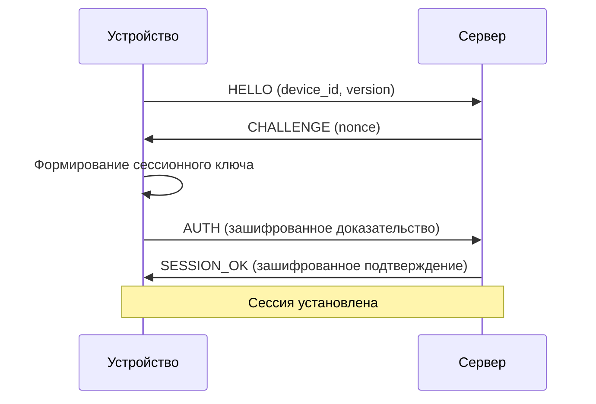

[🇬🇧 English](ewsp.md) | [🇷🇺 Русский](ewsp_RU.md)

# Протокол EWSP

**Encrypted Wake Signaling Protocol** — безопасный протокол связи, используемый WakeLink.

## Обзор

EWSP v1.0 — лёгкий зашифрованный протокол, разработанный для:

- **Ресурсоограниченных устройств** — минимальный объём используемой памяти для ESP8266/ESP32
- **Сквозного шифрования** — сервер выступает слепым ретранслятором
- **Защиты от воспроизведения** — криптографическая цепочка пакетов
- **Эффективности** — формат JSON, читаемый при необходимости

## Версия протокола

Текущая версия: **1.0**

Изменения по сравнению с v1.x:
- Добавлена цепочка пакетов в стиле блокчейна
- Обновлено до XChaCha20-Poly1305
- Добавлены структурированные коды ошибок
- Улучшено формирование ключей

---

## Структура пакета

### Внешний пакет (формат передачи)

```json
{
  "v": 2,
  "id": "550e8400-e29b-41d4-a716-446655440000",
  "seq": 42,
  "prev": "a1b2c3d4e5f6...",
  "p": "<base64-encrypted-payload>",
  "sig": "<hmac-sha256>"
}
```

| Поле | Тип | Описание |
|------|-----|----------|
| `v` | int | Версия протокола (2) |
| `id` | string | Идентификатор запроса (UUID v4) |
| `seq` | int | Порядковый номер (монотонный) |
| `prev` | string | Хеш предыдущего пакета (hex, 32 байта) |
| `p` | string | Зашифрованная нагрузка (base64) |
| `sig` | string | HMAC-SHA256 всего пакета (hex) |

### Внутренний пакет (расшифрованная нагрузка)

```json
{
  "cmd": "WAKE",
  "rid": "req-123",
  "ts": 1705312200,
  "data": {
    "target": "AA:BB:CC:DD:EE:FF"
  }
}
```

| Поле | Тип | Описание |
|------|-----|----------|
| `cmd` | string | Имя команды |
| `rid` | string | Идентификатор запроса для сопоставления |
| `ts` | int | Unix-время |
| `data` | object | Данные, специфичные для команды |

---

## Команды

### Клиент → Устройство

| Команда | Описание | Данные |
|---------|----------|--------|
| `PING` | Проверка связи | Нет |
| `WAKE` | Отправка WoL-пакета | `target`: MAC-адрес |
| `INFO` | Запрос информации об устройстве | Нет |
| `CONFIG` | Обновление конфигурации | Объект конфигурации |
| `OTA` | Запуск обновления прошивки | `url`, `version` |
| `RESTART` | Перезагрузка устройства | Нет |

### Устройство → Сервер

| Команда | Описание | Данные |
|---------|----------|--------|
| `ACK` | Подтверждение команды | `rid`, `status` |
| `STATUS` | Отчёт о статусе | Объект статуса устройства |
| `ERROR` | Отчёт об ошибке | Код ошибки, сообщение |

---

## Процесс шифрования

### Установка сессии



### Формирование ключей

```
PSK = Pre-Shared Key (32 bytes, from device registration)

Session Salt = SHA256(device_id || timestamp || nonce)

Session Key = HKDF-SHA256(
    ikm = PSK,
    salt = Session Salt,
    info = "ewsp-v1-session",
    length = 64
)

Encryption Key = Session Key[0:32]
MAC Key = Session Key[32:64]
```

### Шифрование пакета

1. Сгенерировать случайный nonce из 24 байт
2. Зашифровать нагрузку с помощью XChaCha20-Poly1305
3. Добавить nonce перед шифротекстом
4. Кодировать результат в base64

```
Payload JSON → UTF-8 bytes → XChaCha20-Poly1305 → Base64
```

### Подпись пакета

```
signature = HMAC-SHA256(MAC_Key, canonical_packet)

canonical_packet = JSON.stringify({
    v: v,
    id: id,
    seq: seq,
    prev: prev,
    p: p
}, sorted_keys)
```

---

## Проверка цепочки

Каждый пакет должен ссылаться на предыдущий:

```
Packet N:
  - Compute hash: h_n = SHA256(packet_n_bytes)
  - Verify: packet_{n+1}.prev == h_n
```

### Состояние цепочки

Обе стороны поддерживают:

```
{
  "last_seq": 41,
  "last_hash": "a1b2c3d4...",
  "recv_window": [38, 39, 40, 41]
}
```

### Правила проверки

1. `seq` должен быть > `last_seq`
2. `prev` должен совпадать с `last_hash`
3. `sig` должен быть корректным HMAC
4. `ts` должен находиться в пределах 5 минут от текущего времени

---

## Обработка ошибок

### Коды ошибок

| Код | Название | Описание |
|-----|----------|----------|
| E001 | `INVALID_PACKET` | Некорректная структура пакета |
| E002 | `AUTH_FAILED` | Аутентификация не пройдена |
| E003 | `SEQ_OUT_OF_ORDER` | Неверный порядковый номер |
| E004 | `CHAIN_BROKEN` | Несоответствие хеша цепочки |
| E005 | `SIG_INVALID` | Проверка подписи не пройдена |
| E006 | `TS_EXPIRED` | Время вне допустимого диапазона |
| E007 | `UNKNOWN_CMD` | Неизвестная команда |
| E008 | `CMD_FAILED` | Выполнение команды не удалось |

### Ответ на ошибку

```json
{
  "v": 2,
  "id": "...",
  "seq": 43,
  "prev": "...",
  "p": "<encrypted: { cmd: 'ERROR', rid: 'req-123', data: { code: 'E005', message: 'Signature invalid' } }>",
  "sig": "..."
}
```

---

## Восстановление цепочки

Если цепочка рассинхронизировалась:

1. Отправитель обнаруживает ответ с ошибкой
2. Отправитель отправляет команду `SYNC` со своим состоянием цепочки
3. Получатель отвечает своим состоянием цепочки
4. Обе стороны сбрасываются до согласованного состояния
5. Продолжение с новой последовательностью

```json
{
  "cmd": "SYNC",
  "data": {
    "last_seq": 41,
    "last_hash": "a1b2c3d4..."
  }
}
```

---

## Примечания по реализации

### Требования к памяти

| Компонент | Память |
|-----------|--------|
| Сессионный ключ | 64 байта |
| Состояние цепочки | 48 байт |
| Буфер пакетов | 1 КБ |
| Парсер JSON | 2 КБ |
| **Итого** | ~4 КБ |

### Производительность

| Операция | ESP8266 | ESP32 |
|----------|---------|-------|
| Формирование ключей | 50 мс | 15 мс |
| Шифрование пакета | 5 мс | 2 мс |
| Дешифрование пакета | 5 мс | 2 мс |
| HMAC | 3 мс | 1 мс |

---

## Соображения безопасности

### Повторное использование Nonce

XChaCha20-Poly1305 требует уникальных nonce. Реализация использует:
- Случайный nonce из 24 байт для каждого пакета
- Вероятность коллизии при 2^96 пакетах: пренебрежимо мала

### Атаки по времени

- Сравнение HMAC за константное время
- Дешифрование за константное время

### Побочные каналы

- Отсутствие ветвлений, зависящих от секретных данных
- Отсутствие обращений к памяти, зависящих от секретных данных

---

## Референсная реализация

- **C**: библиотека `ewsp-core`
- **Python**: модуль `wakelink.protocol`
- **Kotlin**: пакет `io.wakelink.protocol`
